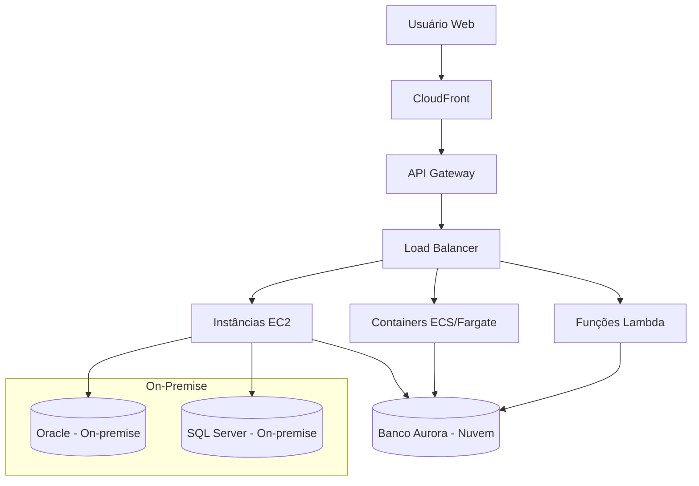

# Diagrama de Topologia – Arquitetura Híbrida AWS + On-Premise

> Este diagrama representa uma arquitetura híbrida onde a aplicação é acessada via API Gateway e distribuída entre EC2, containers e funções serverless, com comunicação com bancos na nuvem e no ambiente local (on-premise).
